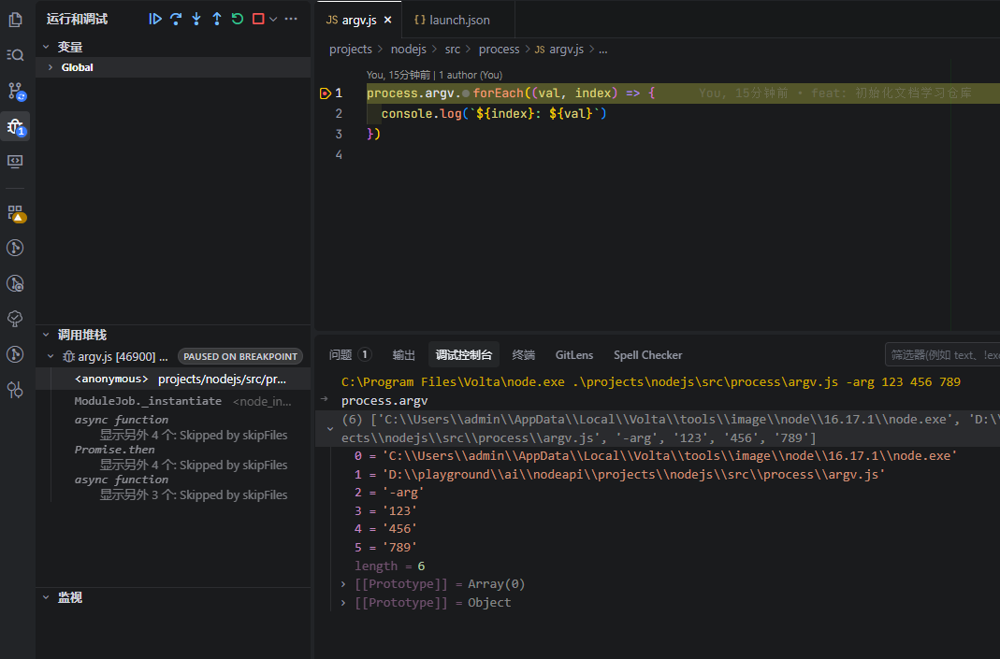

# Official Learning Lab

本仓库是一个“集文档学习 + 特定场景研究”的实验场：把各个技术官网的学习内容拆成独立子项目（workspaces），每个子项目可以单独维护依赖、单独运行与演进。

## 目标

1. Node.js：常用 API 的基本使用（demo 级别）
   - 面向单个 API 的最小示例
   - 面向场景的组合示例：把多个 API 串起来解决一个真实问题（例如：文件处理 + 流式传输 + 性能观测）
2. Vue3：常用 API 的使用场景（demo 级别）
   - `ref/reactive/computed/watch` 等核心能力的最小示例
   - 面向场景的组合示例：表单、状态联动、异步请求、组件通信等
3. 特定场景研究（待办）
   - 前端性能：内存泄漏定位、火焰图分析、长任务/卡顿定位、渲染优化等

## 结构约定（Workspaces）

该仓库采用 npm workspaces：
### 📁 项目目录结构

```text
.
├── node_modules/
├── projects/
│   ├── nodejs/
│   │   ├── node_modules/
│   │   ├── public/
│   │   │   └── statics/
│   │   │       └── argv-debugger.png
│   │   ├── src/
│   │   │   └── .process/
│   │   │       ├── argv.js
│   │   │       └── process.md // 进程相关 API 示例和说明
│   │   └── package.json
│   └── vue/
│       ├── node_modules/
│       ├── src/
│       │   ├── App.vue
│       │   ├── env.d.ts
│       │   └── main.ts
│       ├── index.html
│       ├── package.json
│       ├── tsconfig.json
│       └── vite.config.ts
├── .gitignore
├── package.json
└── README.md
```

约定：
- 每个子项目都有自己的 `package.json`、依赖与脚本
- 根目录只负责聚合入口（统一脚本与工作区声明），不承载具体学习代码

## 快速开始

根目录提供了常用脚本入口（通过 workspace 转发到对应子项目）：

- Vue 子项目
  - `npm run dev`
- Node.js 子项目 调试
```JS
{
    "version": "0.2.0",
    "configurations": [

        {
            "type": "node",
            "name": "process - argv",
            "request": "launch",
            "program": "${workspaceFolder}\\projects\\nodejs\\src\\process\\argv.js",
            "args": [
                "-arg",
                "123",
                "456",
                "789"
            ]
        },
    ]
}
```


## 子项目清单

### projects/vue

定位：Vue3 + Vite + TypeScript 的学习实验场。

建议的内容组织（待逐步补齐）：
- `src/demos/*`：单点 API 的最小示例（每个 demo 聚焦一个点）
- `src/scenarios/*`：面向场景的组合示例（多个 API 协作）

### projects/nodejs

定位：Node.js 常用 API 的学习实验场。

当前示例：
- `src/process/argv.js`：命令行参数读取示例

建议的内容组织（待逐步补齐）：
- `src/apis/*`：单点 API 的最小示例（fs/path/url/stream/http 等）
- `src/scenarios/*`：面向场景的组合示例（CLI 工具、文件批处理、简单服务等）

## TODO

- Node.js 场景：
  - 文件批处理（fs + stream + pipeline）
  - 简易 HTTP 服务（http + 路由 + 静态资源）
  - 日志与性能观测（perf_hooks / console.time / 采样分析）
- Vue3 场景：
  - 表单校验与异步校验（watch + computed + 组件封装）
  - 组件通信与状态管理（provide/inject、组合式函数拆分）
- 前端性能专项：
  - 内存泄漏复现与定位（Heap Snapshot / Allocation Timeline）
  - 火焰图与性能分析（Performance 面板、长任务、渲染瓶颈）

* 其他：
  - 异步编程模型（async/await、Promise 链、回调地狱）
  - 模块系统（CommonJS、ES Modules）
  - 包管理（npm/yarn/pnpm）