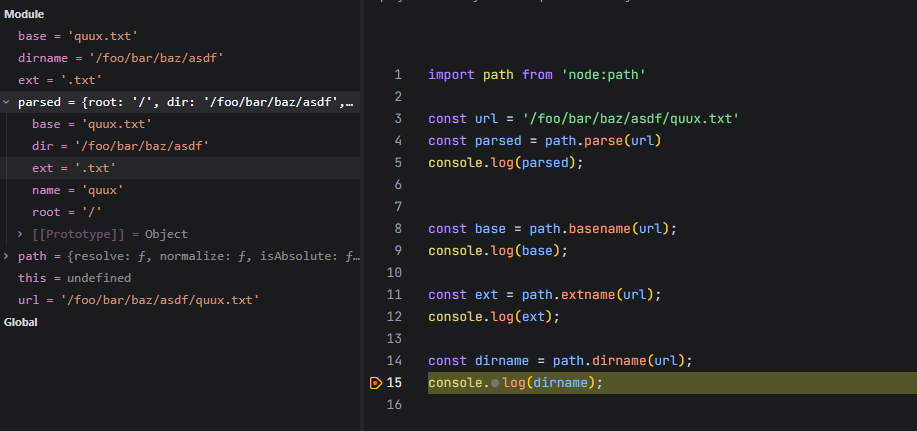

## path.resolve() 方法
> path.resolve() 方法将一系列路径或路径段解析为绝对路径。


* path.resolve() 默认以当前 Node.js 进程的「工作目录（process.cwd()）」为解析起点.
* 无论代码写在项目中哪个层级的 JS 文件里（比如根目录的 index.js、深层目录的 ./doc/a.js），只要这些 JS 文件属于同一个 Node.js 进程，其内部调用的 path.resolve() 所依赖的 process.cwd() 都是同一个值 —— 即启动该进程时执行 node 命令的目录（而非 JS 文件本身的存放目录，也非 JS 文件的执行目录）。

## path.join() 方法
> path.join() 方法使用特定于平台的分隔符作为分隔符，将所有给定的 path 片段连接在一起，然后规范化生成的路径。

## path.parse() 


`path.parse(pathString)` 接收一个路径字符串，并返回一个包含该路径所有关键组成部分的对象。

* root → 根目录
* dir → directory 目录
* base → base name 基础文件名（含后缀）
* ext → extension 文件扩展名
* name → file name 文件名（不含后缀）


```


我们可以将一个完整的路径想象成一个组合体，而 `path.parse` 就是将其拆解的过程。

以 POSIX 系统（如 Linux, macOS）下的 `/home/user/dir/file.txt` 为例：

```text
┌───────────────────────────────┬──────────────┐
│             dir               │     base     │
├──────────┬────────────────────├───────┬──────┤
│   root   │                    │ name  │ ext  │
"    /     home/user/dir       / file   .txt  "
└──────────┴────────────────────┴───────┴──────┘
```

从这个结构可以清晰地看出它们之间的关系：
* base = name + ext
* dir = root + 中间的所有目录
* 完整路径 = dir + path.sep + base


### 跨平台差异 (POSIX vs Windows)

path.parse 的一个巨大优势是它能自动处理不同操作系统的路径差异，确保代码的跨平台兼容性。
1. 在 POSIX 系统上 (Linux, macOS)
javascript

编辑


path.parse('/home/user/dir/file.txt');
// 返回:
// {
//   root: '/',
//   dir: '/home/user/dir',
//   base: 'file.txt',
//   ext: '.txt',
//   name: 'file'
// }
2. 在 Windows 系统上
javascript

编辑


path.parse('C:\\path\\dir\\file.txt');
// 返回:
// {
//   root: 'C:\\',
//   dir: 'C:\\path\\dir',
//   base: 'file.txt',
//   ext: '.txt',
//   name: 'file'
// }
可以看到，在 Windows 上，root 属性会正确地识别出盘符（如 C:\），而 dir 也会包含完整的路径。


## path.dirname() 方法
> path.dirname() 方法返回路径的目录部分。

* dir → directory 目录

```js
path.dirname('/foo/bar/baz/asdf/quux');
// Returns: '/foo/bar/baz/asdf'
```
## path.basename() 方法
> path.basename() 方法返回路径的文件名部分。

* base → base name 基础文件名（含后缀）

```js
path.basename('/foo/bar/baz/asdf/quux.txt');
// Returns: 'quux.txt'
```

* base → base name 基础文件名（含后缀）
  
## path.extname() 方法
> path.extname() 方法返回路径的文件扩展名部分。

```js
path.extname('/foo/bar/baz/asdf/quux.txt');
// Returns: '.txt'
```

* ext → extension 文件扩展名

